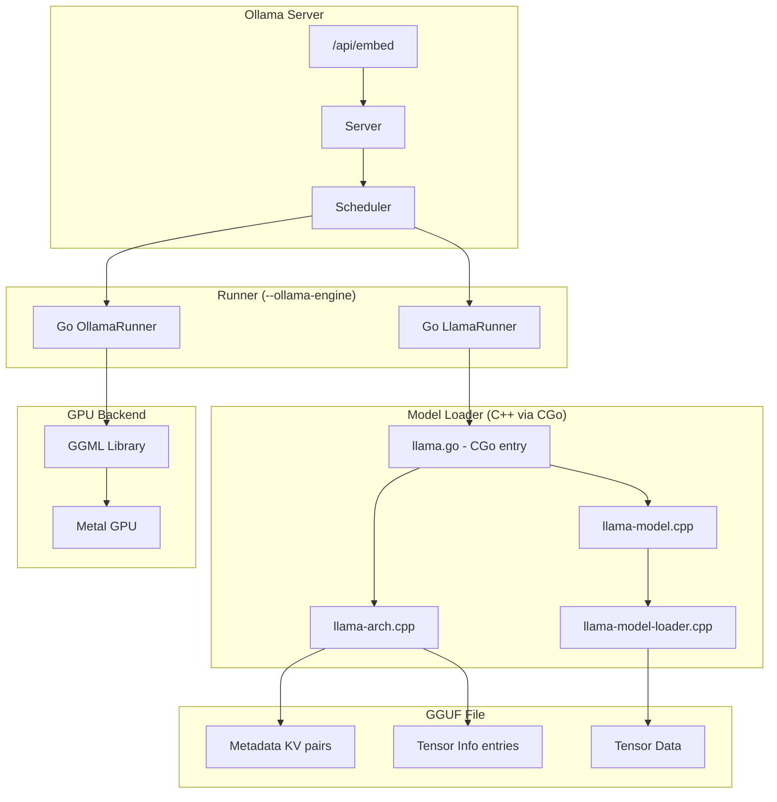
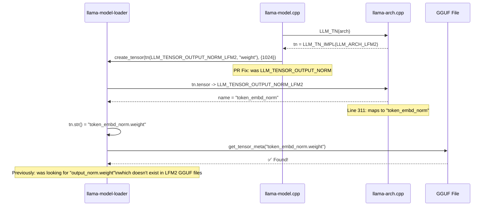
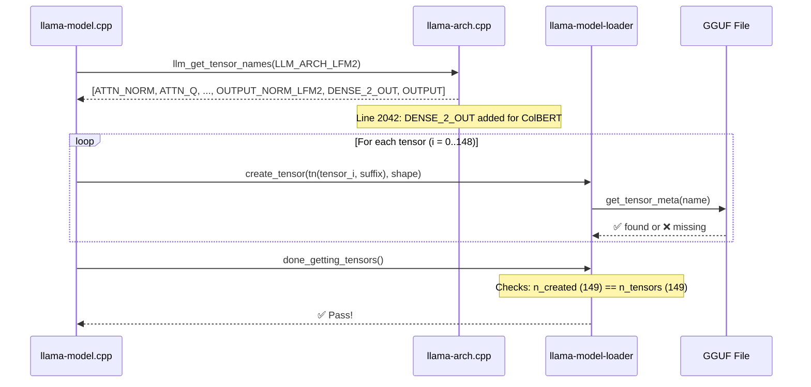
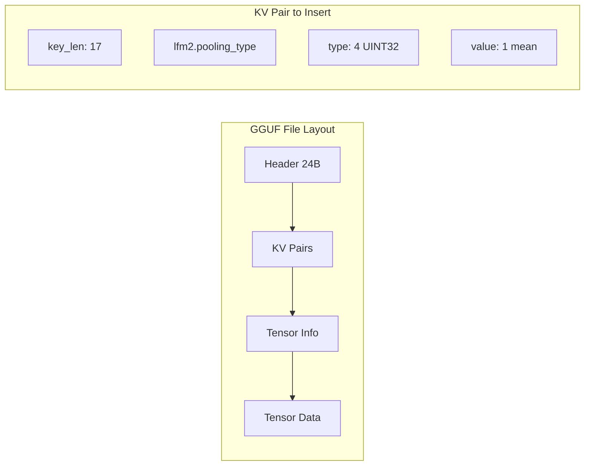
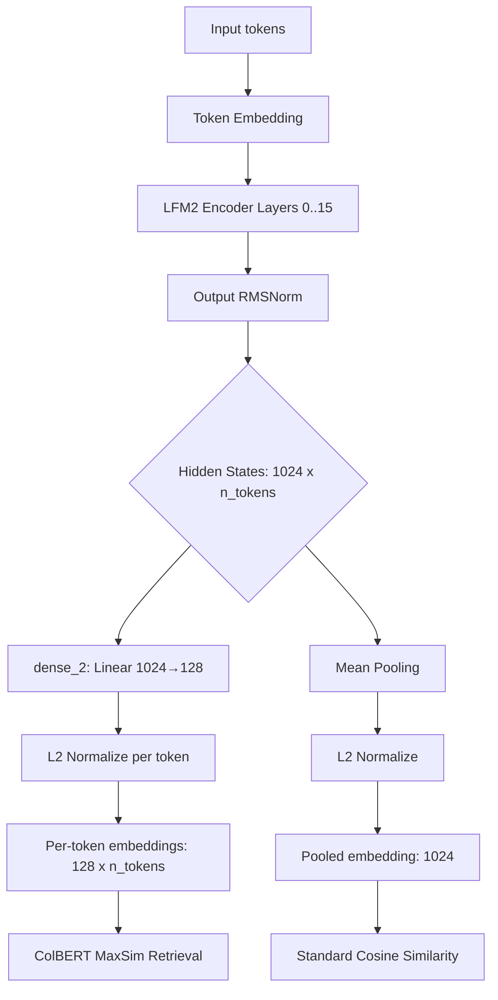

# Design Document — Mermaid Diagrams

## Current Design Scope

As of the June 14 refresh, the active upstream PR design surface is the Ollama converter and embedding documentation:

- LFM2-ColBERT conversion registration.
- SentenceTransformers `modules.json` parsing.
- nested safetensors discovery and tensor-name prefixing.
- dense projection metadata handling for ColBERT-style embedding heads.

The diagrams below document the earlier runtime/GGUF investigation and should be treated as historical/deferred context unless a new runtime track is opened.

## Architecture Overview



## Tensor Name Resolution Flow



## Expected Tensor Validation Flow



## GGUF Binary Structure (for Pooling Type Patching)



## Pooling Type Detection Flow

```mermaid
flowchart TD
    A[Load GGUF] --> B{Has lfm2.pooling_type?}
    B -->|Yes| C[Set arch = lfm2_embed]
    B -->|No| D[Set arch = lfm2]
    C --> E[Capabilities: embedding]
    D --> F[Capabilities: completion]
    E --> G[/api/embed available]
    F --> H[/api/embed returns error]
```

## ColBERT Per-Token Forward Pass (Proposed)


