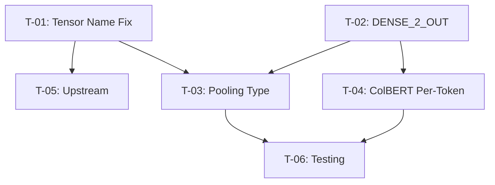

# Implementation Plan

## Current Upstream Scope

As of the June 14 refresh, upstream PR #16195 is a single focused conversion/docs commit at `c65645b58f9c3fbec31af71ed3a508bf8d0124cb`. The older vendored runtime-file changes below are retained as historical context only because current `ollama/ollama:main` no longer tracks those files in that form.

Active work is limited to:

- Keeping PR #16195 rebased and review-ready.
- Responding to upstream review comments.
- Keeping the Hugging Face docs-only artifact/status pages current.

GGUF metadata patching and per-token runtime experiments should happen on a separate branch/track if resumed.

## Phase 0: Foundation (Historical)

### T-01: Tensor Name Fix
- [x] Add `LLM_TENSOR_OUTPUT_NORM_LFM2` to expected tensor list (already existed)
- [x] Change `create_tensor` call from `LLM_TENSOR_OUTPUT_NORM` to `LLM_TENSOR_OUTPUT_NORM_LFM2`
- [x] Verify: `llama-arch.cpp:311` maps to `"token_embd_norm"`
- [x] Build binary and verify error changes from `missing tensor 'output_norm'`
- [x] Submit the original PR #16195 to ollama/ollama

### T-02: DENSE_2_OUT Addition
- [x] Add `LLM_TENSOR_DENSE_2_OUT` to LFM2 expected list at `llama-arch.cpp:2042`
- [x] Commit and push to fork branch
- [ ] Superseded by the June 14 conversion/docs-only PR shape

## Phase 1: Model Loading (Deferred / Separate Track)

### T-03: Pooling Type Metadata
- [ ] Binary-patch Q4_K_M GGUF to insert `lfm2.pooling_type = 1`
- [ ] Alternative: Use gguf library with raw file I/O workaround
- [ ] Alternative: Download F16 model (already has pooling_type) and rename tensor only
- [ ] Verify model shows capabilities: ["embedding"]
- [ ] Test `/api/embed` returns valid embeddings

## Phase 2: SOTA Features (Deferred / Separate Track)

### T-04: ColBERT Per-Token Embeddings
- [ ] Add `dense_2` linear layer to LFM2 Go model struct
- [ ] Implement forward pass: hidden → dense_2 → L2 norm
- [ ] Add per-token embedding output path
- [ ] Extend `/api/embed` response format for multi-vector
- [ ] Test with MaxSim scoring (pylate or manual)

## Phase 3: Polish (Current Review Maintenance)

### T-05: Upstream
- [x] Keep PR #16195 focused on conversion/docs support
- [ ] Consider PR to ggml-org/llama.cpp for both fixes
- [ ] Respond to PR #16195 review feedback

### T-06: Testing
- [ ] Automated test for LFM2 model loading
- [ ] Regression test for existing LFM2 text models
- [ ] Benchmark embeddings vs nomic-embed-text

## Dependencies

## Timeline

| Phase | Started | Completed | Notes |
|-------|---------|-----------|-------|
| Phase 0 | 2026-05-14 | 2026-05-19 | Both fixes committed |
| Phase 1 | 2026-05-19 | — | Deferred out of the current upstream PR after June 14 rebase |
| Phase 2 | — | — | Deferred out of the current upstream PR |
| Phase 3 | 2026-06-14 | — | Current activity is review maintenance for PR #16195 and HF docs freshness |
