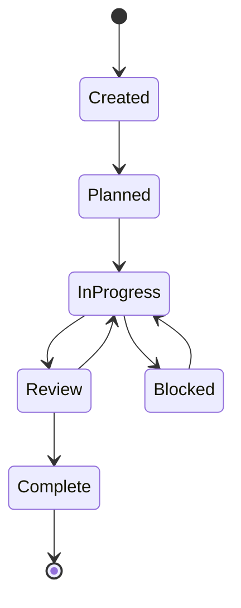

# Conductor Workflow

## Track Lifecycle



## Track States

| State | Meaning |
|-------|---------|
| Created | Track initialized, no work done |
| Planned | Plan documented, dependencies mapped |
| InProgress | Active development |
| Review | Under review (PR review, testing) |
| Blocked | Waiting on dependency or external factor |
| Complete | All acceptance criteria met |

## Commands

```bash
# Create a new track
mkdir -p conductor/tracks/{track_id}

# Add required files
# - index.md     (overview + sub-track table)
# - metadata.json (machine-readable status)
# - requirements.md (MoSCoW requirements)
# - design.md (Mermaid diagrams)
# - contract.md (interface contracts)
# - plan.md (implementation steps)
# - spec.md (technical specification)
```

## Current Track

```bash
ls -la conductor/tracks/colbert-ollama-20260519/
# index.md       - Track overview
# metadata.json  - Machine-readable metadata
# requirements.md - MoSCoW requirements
# design.md      - Mermaid architecture diagrams
# contract.md    - Interface contracts
# plan.md        - Implementation plan
# spec.md        - Technical specification
```

## Handoff Protocol

When handing off to another agent:
1. All tracks should have `"handoff": true` in metadata.json
2. `HANDOFF.md` at repo root provides quick-start
3. Git branch is clean (committed + pushed)
4. Build artifacts are documented with absolute paths
5. Blocked tracks have `blocked_by` reasons in metadata
